# 30 Scenarios with SQL

## Introduction
As a data analyst, SQL (Structured Query Language) is an essential tool for managing and analyzing data. SQL allows data analysts to retrieve, manipulate, and transform data stored in databases. In this project, I will explore some common SQL scenarios that data analysts frequently encounter in their work. By understanding these scenarios, data analysts can effectively utilize SQL to extract valuable insights from large datasets and make data-driven decisions.

**Sample Database:** _AdventureWorks2017.bak_ 

**Tool:** _Azure Data Studio_

These scenarios can range from simple data retrieval to complex data transformations and aggregations. Here are 30 scenario SQL cases that you may come across in your job:

### Scenario 1: Sort a result set by one column in ascending or descending order 
**Problem Statement:** Order the 'country names' in ascending order from A-Z  

<pre>
select * from Person.CountryRegion  
order by Name ASC
  </pre>

**Problem Statement:** Order the 'country names' in descending order from Z-A  

<pre>
select * from Person.CountryRegion  
order by Name DESC
  </pre>

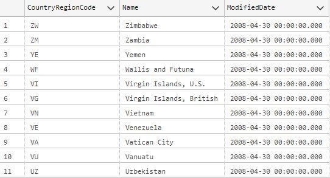

### Scenario 2: Sort a result set by an expression  
**Problem Statement:** List the "comments with more words" to get more insight about a product

<pre>
select ProductID, ReviewerName, Rating, Comments  
from Production.ProductReview  
order by len(Comments) DESC  
  </pre>

### Scenario 3: Retrieve 10% of the result set    

<pre>
select TransactionID, ProductID, TransactionDate, TransactionType  
from Production.TransactionHistory 
  </pre>
--113,443 rows returned * 10% = 11,345

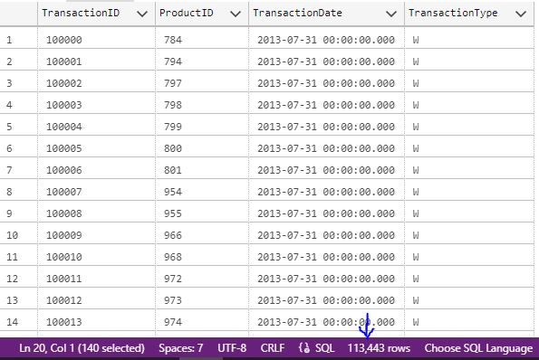

**Problem Statement:** Display only the first 10% rows

<pre>
select Top 10 percent  
TransactionID, ProductID, TransactionDate, TransactionType  
from Production.TransactionHistory
  </pre>
--11,345 rows returned

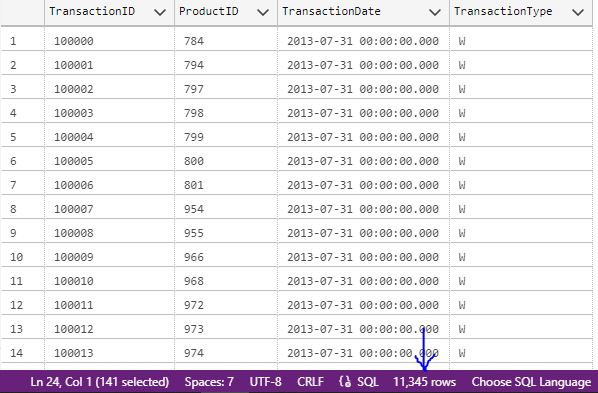

### Scenario 4: Retrieve distinct values in a column 

<pre>
select * from Sales.CreditCard
  </pre>

<pre>
select CardType from Sales.CreditCard
  </pre>

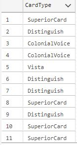

**Problem Statement:** Find the total Card Types without any duplication

<pre>
select distinct CardType from Sales.CreditCard
  </pre>

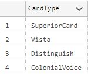

### Scenario 5: Return values based on one condition  

<pre>
select ProductID, ReviewerName, Rating from Production.ProductReview
  </pre>

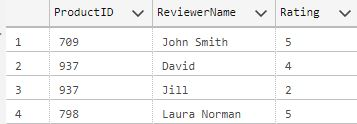

**Problem Statement:** Display the output to be more understandable (1=Poor, 2=Fair, 3=Good, 4=Very Good, 5=Excellent)

<pre>
select ProductID, ReviewerName,   
       case Rating  
        when 1 then 'Poor'  
        when 2 then 'Fair'  
        when 3 then 'Good'  
        when 4 then 'Very Good'  
        when 5 then 'Excellent'  
       end as Rating  
from Production.ProductReview  
  </pre>

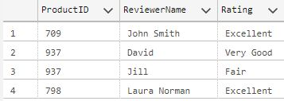

### Scenario 6: Replace NULL values with specific values 

<pre>
select BillOfMaterialsID, ProductAssemblyID, StartDate 
from Production.BillOfMaterials
  </pre>

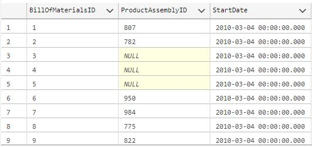

**Problem Statement:** Instead of NULL values we need to have value 0 for 'ProductAssemblyID' column "without changing any value" in the table

<pre>
select BillOfMaterialsID, 
       ISNULL(ProductAssemblyID,0) AS ProductAssemblyID, 
       StartDate 
from Production.BillOfMaterials
  </pre>
  
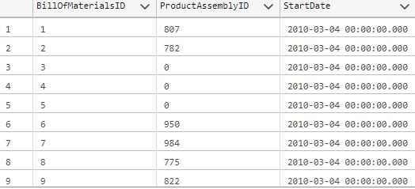

### Scenario 7: Replacing the table or column name temporarily 

<pre>
select ProductModelID, ProductDescriptionID 
from Production.ProductModelProductDescriptionCulture
  </pre>

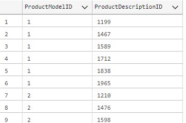

**Problem Statement** Name columns and table name with an Alias

<pre>
select ProductModelID AS ID, 
       ProductDescriptionID AS DescID
from Production.ProductModelProductDescriptionCulture AS Table1
  </pre>

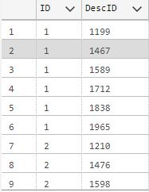

### Scenario 8: Filtering out information  

<pre>
select * from Person.AddressType
  </pre>

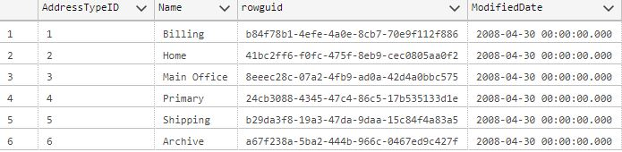

**Problem Statement:** Filter out rows that has the name 'Archive' from the display

<pre>
select * from Person.AddressType
where NOT Name = 'Archive'
  </pre>

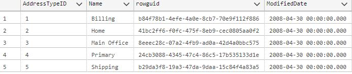

### Scenario 9: Filtering on more than 1 condition   

<pre>
select * from Purchasing.PurchaseOrderDetail
  </pre>

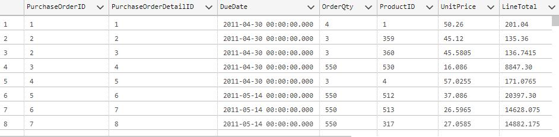

**Problem Statement:** Find all purchase order for the ProductID = 512 that costs less than $35 unit price

<pre>
select * from Purchasing.PurchaseOrderDetail
where ProductID = 512 AND UnitPrice <35
  </pre>

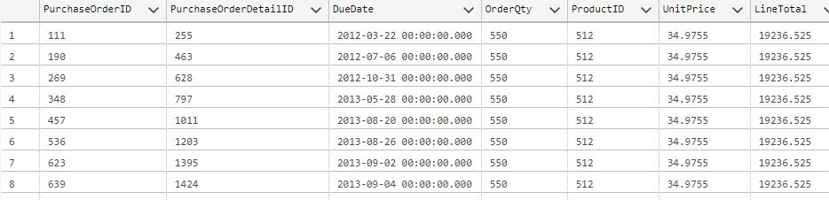

### Scenario 10: Search within a range of values  

<pre>
select Name, ProductNumber, ListPrice from Production.Product
  </pre>

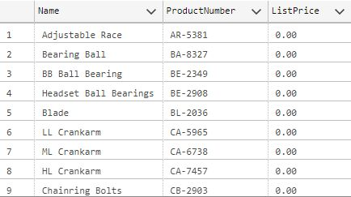

**Problem Statement:** Find the name of products that has a list price in the range of $10-$20

<pre>
select Name, ProductNumber, ListPrice from Production.Product
where ListPrice BETWEEN 10 AND 20
  </pre>

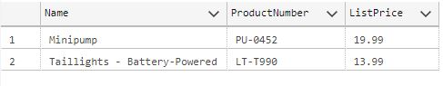

### Scenario 11: Filtering out data by comparing values  

<pre>
select * from Production.WorkOrder
  </pre>

**Problem Statement:** 
1. Find records for Products with ProductID = 995
2. Find records for Products with ProductID = 995 that has more than 500 orders  
3. Find records for Products with ProductID = 995 that has more than 500 orders and received before May 3, 2013

<pre>
select * from Production.WorkOrder
where ProductID = 995
  </pre>

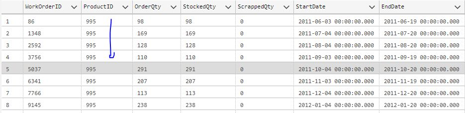

<pre>
select * from Production.WorkOrder
where ProductID = 995 AND OrderQty > 500
  </pre>

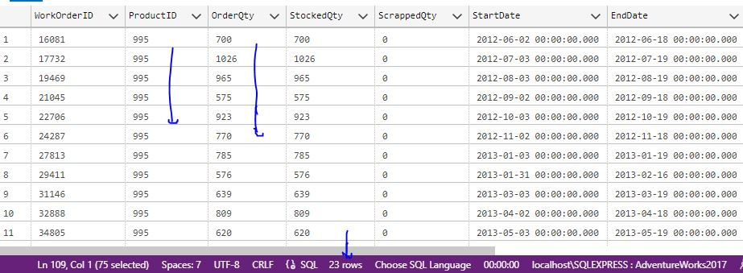

<pre>
select * from Production.WorkOrder
where ProductID = 995 AND OrderQty > 500 AND StartDate < '2013-05-03'
  </pre>

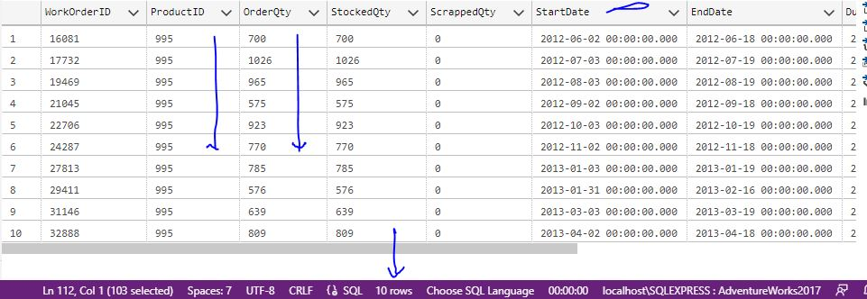

### Scenario 12: Finding rows based on a list of values  

<pre>
select Name, ListPrice from Production.Product
  </pre>

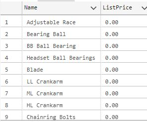

**Problem Statement:** Find the name of products that has these 3 ListPrice values: 106.50, 1003.91, 333.42

<pre>
select Name, ListPrice from Production.Product
where ListPrice IN (106.50, 1003.91, 333.42)
  </pre>

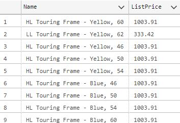

### Scenario 13: Finding rows based on a list of values  

<pre>
select * from Person.CountryRegion
  </pre>

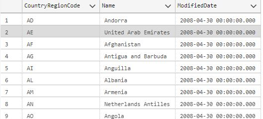

**Problem Statement:** Need to find the name of the countries that start with the letter 'V'

<pre>
select * from Person.CountryRegion
where Name like 'V%'
  </pre>

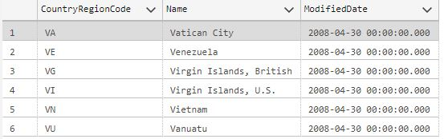

**Problem Statement:** Need to find the name of the countries that start with the letter 'Vi'

<pre>
select * from Person.CountryRegion
where Name like 'Vi%'
  </pre>

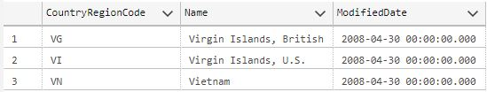

### Scenario 14: Filtering rows having no data value in the column  

<pre>
select * from Production.WorkOrder
  </pre>

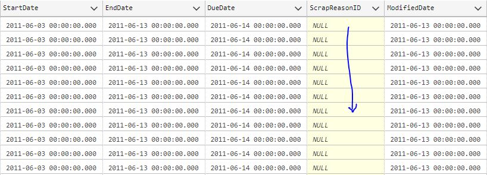

**Problem Statement:** Find Work Orders that has a Scrap Reason

<pre>
select * from Production.WorkOrder
where ScrapReasonID IS NOT NULL
  </pre>

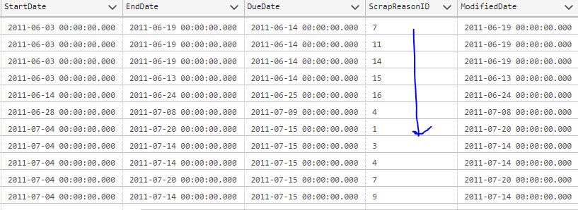

### Scenario 15: Filtering rows based on some values in a sub-query (look-up method)   

<pre>
select * from Production.WorkOrder
  </pre>

**Problem Statement:** Find the Name of Products having more than 20,000 Order Quantity

<pre>
select ProductID from Production.WorkOrder
where OrderQty > 20000                          
  </pre>
  --Query 1

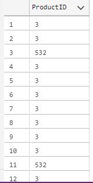

Name of Products from another Table

<pre>
select ProductID, Name from Production.Product  
  </pre>
  --Query 2

<pre>
select ProductID, Name from Production.Product
where ProductID = ANY(
   select ProductID from Production.WorkOrder
where OrderQty > 20000     
)                                                                        
  </pre>
  --Query 1 inside Query 2

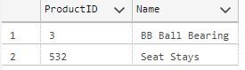

### Scenario 16: Return values by converting them into Upper or Lower case   

<pre>
select Name, ProductNumber from Production.Product
  </pre>

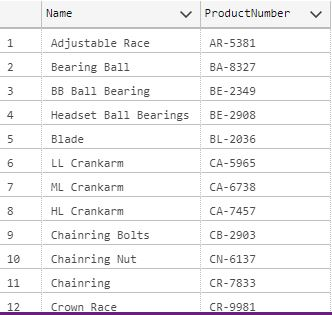

**Problem Statement:** The "ProductNumber" has Characters in uppercase.   
So, Covert characters in "Name" column also in uppercase

<pre>
select UPPER(Name) AS Name, ProductNumber from Production.Product                         
  </pre>

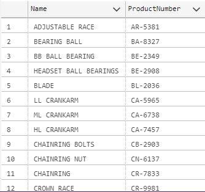

Converting to "ProductNumber" lowercase characters

<pre>
select Name, LOWER(ProductNumber) AS ProductNumber from Production.Product 
  </pre>

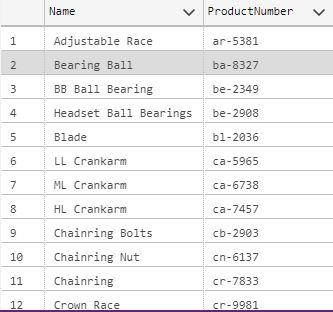

### Scenario 17: Return values by extracting specific characters   

<pre>
select Name, ProductNumber from Production.Product
  </pre>

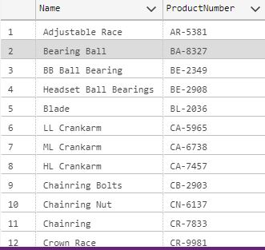

**Problem Statement:** Get(extract) only the 2 characters from the "ProductName" for each "Name" column

<pre>
select Name, LEFT(ProductNumber,2) AS ProductNumber from Production.Product                         
  </pre>
-- Left function

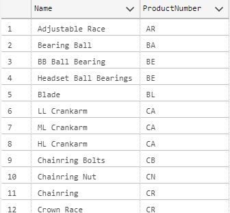

**Problem Statement:** Get(extract) only the 4 numbers from the "ProductName" for each "Name" column

<pre>
select Name, RIGHT(ProductNumber,4) AS ProductNumber from Production.Product
  </pre>
-- Right function

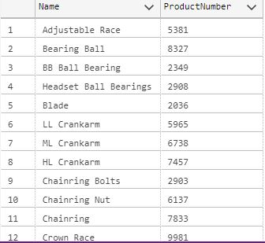

### Scenario 18: Select records that has matching values in two tables   

<pre>
select WorkOrderID, ProductID from Production.WorkOrder
  </pre>

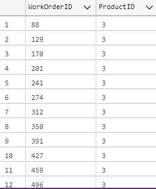

**Problem Statement:** Find the "Product Name" of each ProductID along the with the WorkOrderID

<pre>
select ProductID, Name from Production.Product                      
  </pre>
-- Getting the Product Name

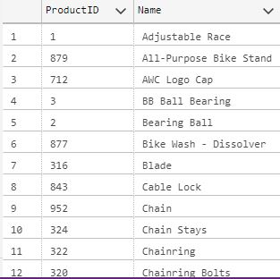

<pre>
select A.WorkOrderID, A.ProductID, B.Name from Production.WorkOrder AS A
INNER JOIN Production.Product AS B
ON A.ProductID = B.ProductID 
  </pre>
-- Innner Join

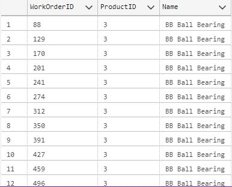

### Scenario 19: Select all records from first table and only the matching records from second table   

<pre>
select ProductID, Name from Production.Product
  </pre>

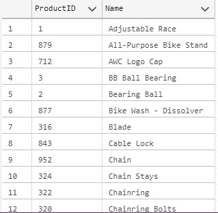

**Problem Statement:** Find the Sales Orders for all ProductID's along with the ProductID and Name

<pre>
select ProductID, SalesOrderID from Sales.SalesOrderDetail                     
  </pre>
-- Sales Order details

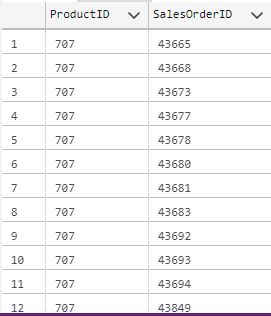

<pre>
select A.ProductID, A.Name, B.SalesOrderID from Production.Product AS A
LEFT JOIN Sales.SalesOrderDetail AS B
ON A.ProductID = B.ProductID
  </pre>
-- Left Join

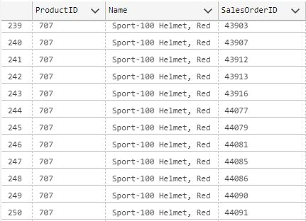

### Scenario 20: Select all records from second table and only the matching records from first table   

<pre>
select ProductID, Name from Production.Product
  </pre>
-- First Table

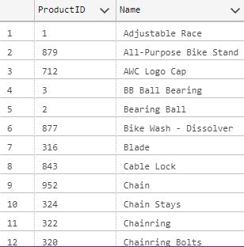

<pre>
select ProductID, Comments from Production.ProductReview
  </pre>
-- Second Table

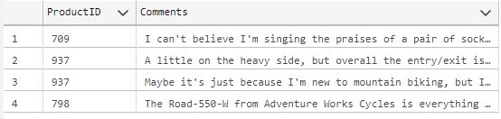

**Problem Statement:** Find the reviews of products along with the product name (Right Join)

<pre>
select B.ProductID, B.Comments, A.Name from Production.Product AS A
RIGHT JOIN Production.ProductReview AS B 
ON A.ProductID = B.ProductID
   </pre>

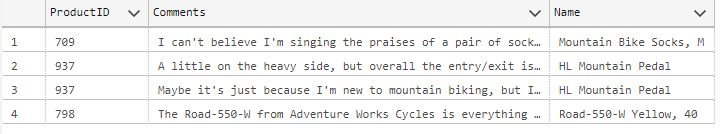

### Scenario 21: Select all records from two tables when there is a match between them or not    

<pre>
select ProductID, Name, ProductSubcategoryID from Production.Product 
  </pre>
-- Product Table

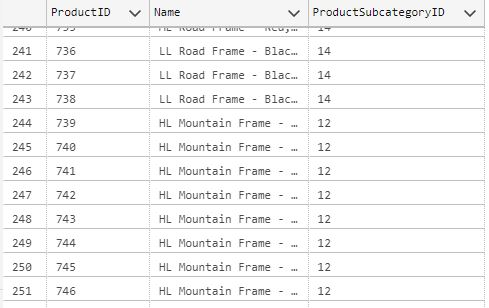

**Problem Statement:** Find the Sub-category name to which each Product belongs, 
and also find if any Sub-category name is not assigned to a Product name

<pre>
select ProductSubcategoryID, Name from Production.ProductSubcategory
  </pre>
-- Sub-category Table

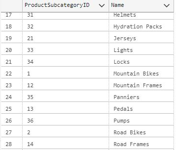

<pre>
select A.ProductID, A.Name, A.ProductSubcategoryID, B.Name from Production.Product AS A
FULL JOIN Production.ProductSubcategory AS B 
ON A.ProductSubcategoryID = B.ProductSubcategoryID
   </pre>
-- Full Join

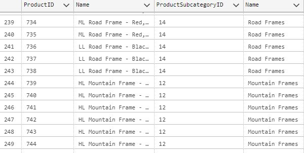

### Scenario 22: Return the number of items found in a result set 

<pre>
select COUNT(ProductNumber) from Production.Product
  </pre>

**Problem Statement:** Check how many product Numbers are there without any duplication

<pre>
select distinct COUNT(ProductNumber) from Production.Product
  </pre>

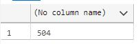

### Scenario 23: Compute the total amount  

<pre>
select SalesOrderID, ProductID, LineTotal, ModifiedDate from Sales.SalesOrderDetail
  </pre>

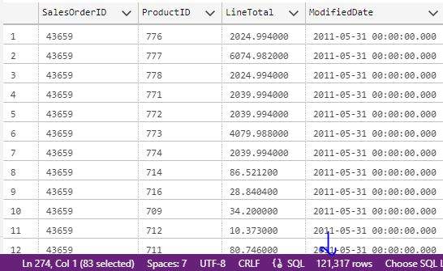

**Problem Statement:** Find the Total revenue from the Product 777 sold in the year 2011

<pre>
select SalesOrderID, ProductID, LineTotal, ModifiedDate from Sales.SalesOrderDetail
where ProductID = 777 
and ModifiedDate BETWEEN '2011-01-01' AND '2011-12-31'
  </pre>

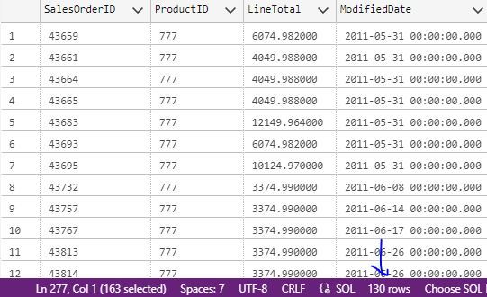

<pre>
select SUM(LineTotal) from Sales.SalesOrderDetail
where ProductID = 777 
and ModifiedDate BETWEEN '2011-01-01' AND '2011-12-31'
   </pre>
-- Total Revenue

### Scenario 24: Compute the average value

<pre>
select SalesOrderID, ProductID, LineTotal, ModifiedDate from Sales.SalesOrderDetail
  </pre>

**Problem Statement:** Find the Average Price on which the Product 777 got sold in 2011

<pre>
select SalesOrderID, ProductID, LineTotal, ModifiedDate from Sales.SalesOrderDetail
where ProductID = 777
and ModifiedDate BETWEEN '2011-01-01' AND '2011-12-31'
  </pre>

<pre>
select AVG(LineTotal) from Sales.SalesOrderDetail
where ProductID = 777
and ModifiedDate BETWEEN '2011-01-01' AND '2011-12-31'
   </pre>
-- Average

### Scenario 25: Compute the lowest value  
**Problem Statement:** Check how many product Numbers are there without any duplication

<pre>
select * from Production.ProductInventory
where ProductID = 944
  </pre>

<pre>
select MIN(Quantity) from Production.ProductInventory
where ProductID = 944
  </pre>

### Scenario 26: Compute the largest value   
**Problem Statement:** Find the largest quantity in stock for the ProductID 747

<pre>
select * from Production.ProductInventory
where ProductID = 747
  </pre>

<pre>
select MAX(Quantity) from Production.ProductInventory
where ProductID = 747
  </pre>

### Scenario 27: Combine values from two columns into one column     

<pre>
select StateProvinceID, StateProvinceCode, Name from Person.StateProvince
  </pre>

**Problem Statement:** Display State Code and State Name in this format: State Code-State Name.
Example: for State Code-AK and State Name- Alaska, need to display as 'Ak-Alaska'

<pre>
select StateProvinceID, CONCAT(StateProvinceCode, '-', Name) from Person.StateProvince
   </pre>

<pre>
select StateProvinceID, CONCAT(StateProvinceCode, '-', Name) AS State from Person.StateProvince
   </pre>
-- Using 'State' as the column name

### Scenario 28: Create a calculated field   

<pre>
select ProductID, UnitPrice, OrderQty, LineTotal, RejectedQty from Purchasing.PurchaseOrderDetail
  </pre>

**Problem Statement:** Find the Amount lost due to the rejected quantity

<pre>
select ProductID,
       UnitPrice,
       OrderQty,
       LineTotal,
       RejectedQty,
       (UnitPrice * RejectedQty) AS LossAmount
from Purchasing.PurchaseOrderDetail
  </pre>

### Scenario 29: Arrange rows in groups   

<pre>
select ProductID, Quantity from Production.ProductInventory
  </pre>

**Problem Statement:** Find the lowest Quantity for each ProductID in the Inventory

<pre>
select ProductID, MIN(Quantity) AS MinQuantity from Production.ProductInventory
GROUP BY ProductID 
  </pre>

### Scenario 30: Filter Groups based on condition   

<pre>
select ProductID, Quantity, LocationID from Production.ProductInventory
  </pre>

**Problem Statement:** If the location 'LocationID' is less than 3 for a ProductID,
then we need to find the lowest stock quantity 'Quantity' for only that ProductID

<pre>
select ProductID,
       MIN(Quantity) AS MinCount,
       COUNT(LocationID) AS Locations 
from Production.ProductInventory
GROUP BY ProductID
HAVING COUNT(LocationID) < 3
  </pre>

## Conclusion
In conclusion, SQL is a powerful tool for data analysts to manage and analyze data. By mastering SQL and understanding various scenarios, data analysts can efficiently retrieve, manipulate, and transform data to derive valuable insights. Whether it is querying databases, aggregating data, or performing complex calculations, SQL provides the necessary capabilities to handle diverse data analysis tasks.  
By continuously honing their SQL skills, data analysts can become more proficient in their work and contribute to making informed business decisions based on data-driven insights.

