# 30 Scenarios with SQL

## Introduction
As a data analyst, SQL (Structured Query Language) is an essential tool for managing and analyzing data. SQL allows data analysts to retrieve, manipulate, and transform data stored in databases. In this project, I will explore some common SQL scenarios that data analysts frequently encounter in their work. By understanding these scenarios, data analysts can effectively utilize SQL to extract valuable insights from large datasets and make data-driven decisions.

Sample Database: _AdventureWorks2017.bak_ 

Tool: _Azure Data Studio_

These scenarios can range from simple data retrieval to complex data transformations and aggregations. Here are 30 scenario SQL cases that you may come across in your job:

### Scenario 1: Sort a result set by one column in ascending or descending order 
_Problem Statement: Order the 'country names' in ascending order from A-Z_  

<pre>
select * from Person.CountryRegion  
order by Name ASC
  </pre>

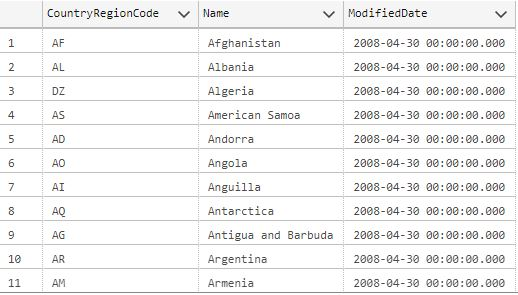

_Problem Statement: Order the 'country names' in descending order from Z-A_  

<pre>
select * from Person.CountryRegion  
order by Name DESC
  </pre>

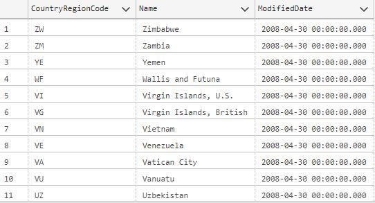

### Scenario 2: Sort a result set by an expression  
_Problem Statement: List the "comments with more words" to get more insight about a product_

<pre>
select ProductID, ReviewerName, Rating, Comments  
from Production.ProductReview  
order by len(Comments) DESC  
  </pre>

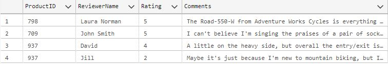

### Scenario 3: Retrieve 10% of the result set    

<pre>
select TransactionID, ProductID, TransactionDate, TransactionType  
from Production.TransactionHistory 
  </pre>
--113,443 rows returned * 10% = 11,345

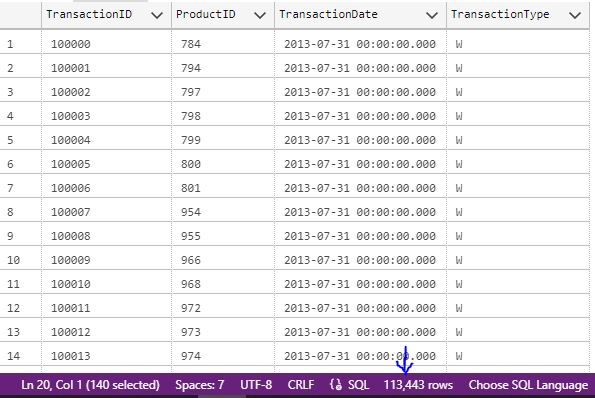

_Problem Statement: Display only the first 10% rows_

<pre>
select Top 10 percent  
TransactionID, ProductID, TransactionDate, TransactionType  
from Production.TransactionHistory
  </pre>
--11,345 rows returned

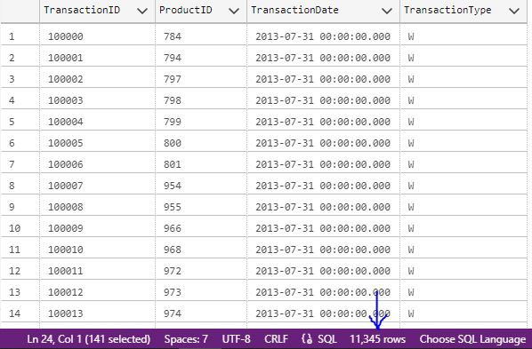

### Scenario 4: Retrieve distinct values in a column 

<pre>
select * from Sales.CreditCard
  </pre>

<pre>
select CardType from Sales.CreditCard
  </pre>

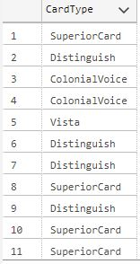

_Problem Statement: Find the total Card Types without any duplication_

<pre>
select distinct CardType from Sales.CreditCard
  </pre>

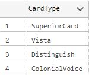

### Scenario 5: Return values based on one condition  

<pre>
select ProductID, ReviewerName, Rating from Production.ProductReview
  </pre>

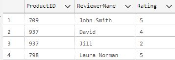

_Problem Statement: Display the output to be more understandable (1=Poor, 2=Fair, 3=Good, 4=Very Good, 5=Excellent)_

<pre>
select ProductID, ReviewerName,   
       case Rating  
        when 1 then 'Poor'  
        when 2 then 'Fair'  
        when 3 then 'Good'  
        when 4 then 'Very Good'  
        when 5 then 'Excellent'  
       end as Rating  
from Production.ProductReview  
  </pre>

### Scenario 6: Replace NULL values with specific values 

<pre>
select BillOfMaterialsID, ProductAssemblyID, StartDate 
from Production.BillOfMaterials
  </pre>

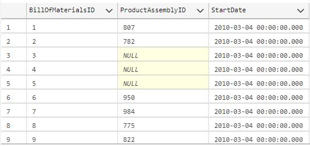

_Problem Statement: Instead of NULL values we need to have value 0 for 'ProductAssemblyID' column "without changing any value" in the table_

<pre>
select BillOfMaterialsID, 
       ISNULL(ProductAssemblyID,0) AS ProductAssemblyID, 
       StartDate 
from Production.BillOfMaterials
  </pre>
  
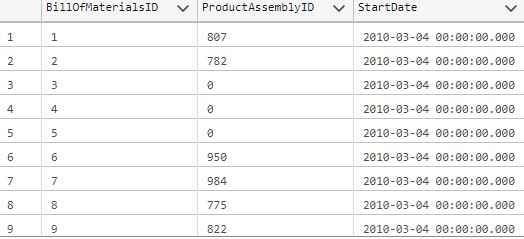

### Scenario 7: Replacing the table or column name temporarily 

<pre>
select ProductModelID, ProductDescriptionID 
from Production.ProductModelProductDescriptionCulture
  </pre>

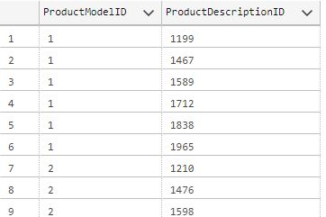

_Problem Statement: Name columns and table name with an Alias_

<pre>
select ProductModelID AS ID, 
       ProductDescriptionID AS DescID
from Production.ProductModelProductDescriptionCulture AS Table1
  </pre>

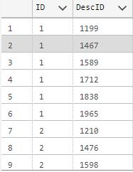

### Scenario 8: Filtering out information  

<pre>
select * from Person.AddressType
  </pre>

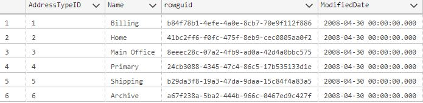

_Problem Statement: Filter out rows that has the name 'Archive' from the display_

<pre>
select * from Person.AddressType
where NOT Name = 'Archive'
  </pre>

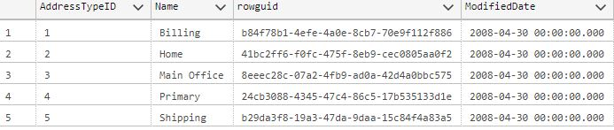

### Scenario 9: Filtering on more than 1 condition   

<pre>
select * from Purchasing.PurchaseOrderDetail
  </pre>

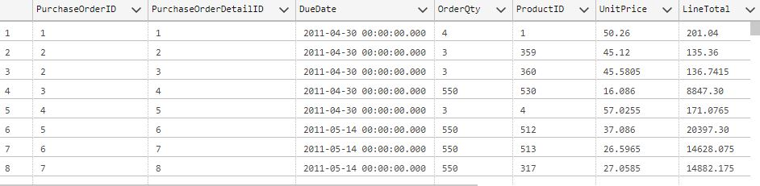

_Problem Statement: Find all purchase order for the ProductID = 512 that costs less than $35 unit price_

<pre>
select * from Purchasing.PurchaseOrderDetail
where ProductID = 512 AND UnitPrice <35
  </pre>

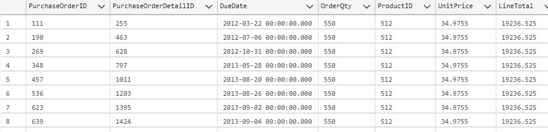

### Scenario 10: Search within a range of values  

<pre>
select Name, ProductNumber, ListPrice from Production.Product
  </pre>

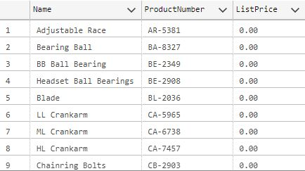

_Problem Statement: Find the name of products that has a list price in the range of $10-$20_

<pre>
select Name, ProductNumber, ListPrice from Production.Product
where ListPrice BETWEEN 10 AND 20
  </pre>

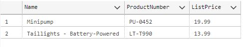

### Scenario 11: Filtering out data by comparing values  

<pre>
select * from Production.WorkOrder
  </pre>

_Problem Statement: -- 1. Find records for Products with ProductID = 995  
-- 2. Find records for Products with ProductID = 995 that has more than 500 orders  
-- 3. Find records for Products with ProductID = 995 that has more than 500 orders and received before May 3, 2013_

<pre>
select * from Production.WorkOrder
where ProductID = 995
  </pre>

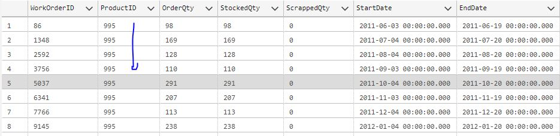

<pre>
select * from Production.WorkOrder
where ProductID = 995 AND OrderQty > 500
  </pre>

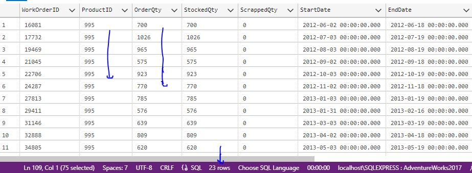

<pre>
select * from Production.WorkOrder
where ProductID = 995 AND OrderQty > 500 AND StartDate < '2013-05-03'
  </pre>

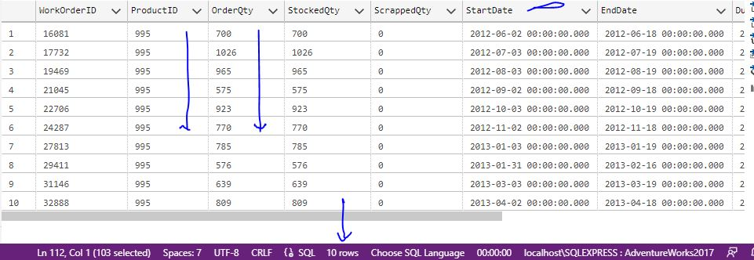

### Scenario 12: Finding rows based on a list of values  

<pre>
select Name, ListPrice from Production.Product
  </pre>

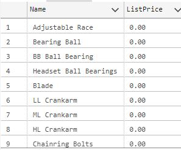

_Problem Statement: Find the name of products that has these 3 ListPrice values: 106.50, 1003.91, 333.42_

<pre>
select Name, ListPrice from Production.Product
where ListPrice IN (106.50, 1003.91, 333.42)
  </pre>

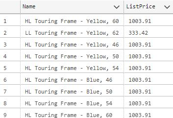

### Scenario 13: Finding rows based on a list of values  

<pre>
select * from Person.CountryRegion
  </pre>

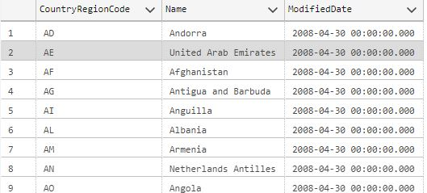

_Problem Statement: Need to find the name of the countries that start with the letter 'V'_

<pre>
select * from Person.CountryRegion
where Name like 'V%'
  </pre>

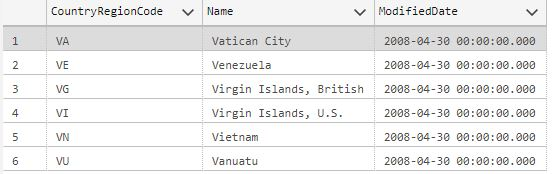

_Problem Statement: Need to find the name of the countries that start with the letter 'Vi'_

<pre>
select * from Person.CountryRegion
where Name like 'Vi%'
  </pre>

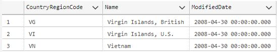

### Scenario 14: Filtering rows having no data value in the column  

<pre>
select * from Production.WorkOrder
  </pre>

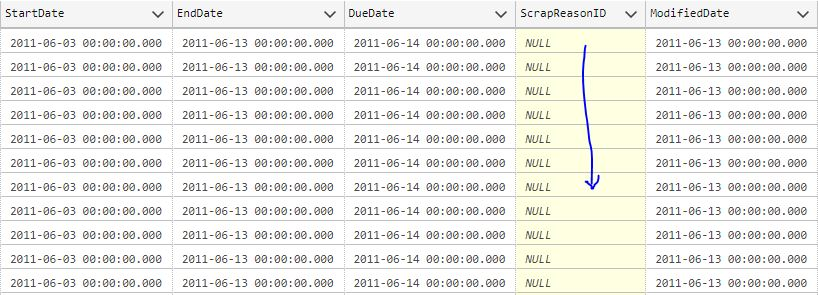

_Problem Statement: Find Work Orders that has a Scrap Reason_

<pre>
select * from Production.WorkOrder
where ScrapReasonID IS NOT NULL
  </pre>

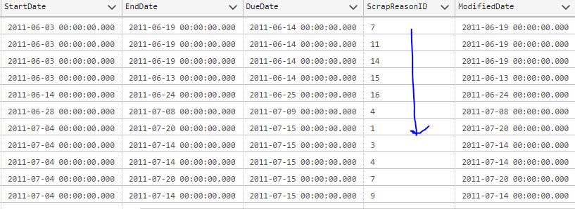

### Scenario 15: Filtering rows based on some values in a sub-query (look-up method)   

<pre>
select * from Production.WorkOrder
  </pre>

_Problem Statement: Find the Name of Products having more than 20,000 Order Quantity_

<pre>
select ProductID from Production.WorkOrder
where OrderQty > 20000                          
  </pre>
  --Query 1

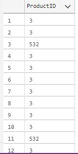

_Name of Products from another Table_

<pre>
select ProductID, Name from Production.Product  
  </pre>
  --Query 2

<pre>
select ProductID, Name from Production.Product
where ProductID = ANY(
   select ProductID from Production.WorkOrder
where OrderQty > 20000     
)                                                                        
  </pre>
  --Query 1 inside Query 2

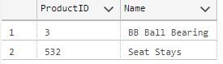

### Scenario 16: Return values by converting them into Upper or Lower case   

<pre>
select Name, ProductNumber from Production.Product
  </pre>

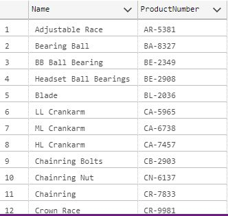

_Problem Statement: The "ProductNumber" has Characters in uppercase.   
So, Covert characters in "Name" column also in uppercase_

<pre>
select UPPER(Name) AS Name, ProductNumber from Production.Product                         
  </pre>

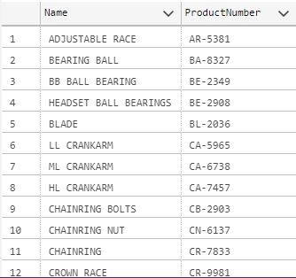

_Converting to "ProductNumber" lowercase characters_

<pre>
select Name, LOWER(ProductNumber) AS ProductNumber from Production.Product 
  </pre>

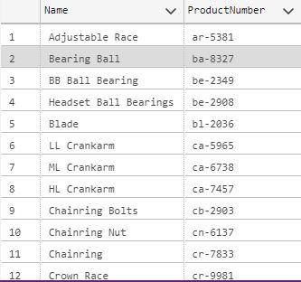

### Scenario 17: Return values by extracting specific characters   

<pre>
select Name, ProductNumber from Production.Product
  </pre>

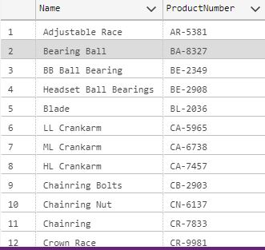

_Problem Statement: Get(extract) only the 2 characters from the "ProductName" for each "Name" column_

<pre>
select Name, LEFT(ProductNumber,2) AS ProductNumber from Production.Product                         
  </pre>
-- Left function

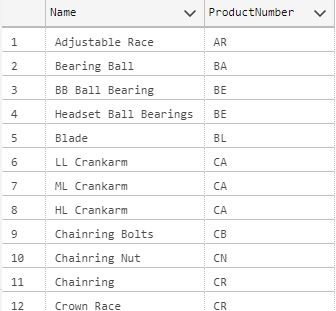

_Problem Statement: Get(extract) only the 4 numbers from the "ProductName" for each "Name" column_

<pre>
select Name, RIGHT(ProductNumber,4) AS ProductNumber from Production.Product
  </pre>
-- Right function

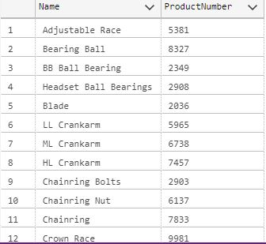

### Scenario 18: Select records that has matching values in two tables   

<pre>
select WorkOrderID, ProductID from Production.WorkOrder
  </pre>

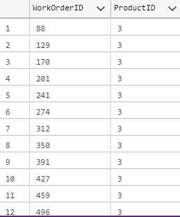

_Problem Statement: Find the "Product Name" of each ProductID along the with the WorkOrderID_

<pre>
select ProductID, Name from Production.Product                      
  </pre>
-- Getting the Product Name

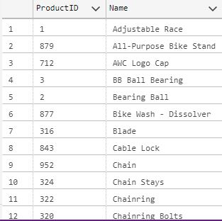

<pre>
select A.WorkOrderID, A.ProductID, B.Name from Production.WorkOrder AS A
INNER JOIN Production.Product AS B
ON A.ProductID = B.ProductID 
  </pre>
-- Innner Join

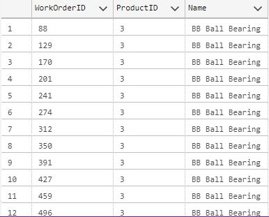

### Scenario 19: Select all records from first table and only the matching records from second table   

<pre>
select ProductID, Name from Production.Product
  </pre>

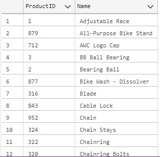

_Problem Statement: Find the Sales Orders for all ProductID's along with the ProductID and Name_

<pre>
select ProductID, SalesOrderID from Sales.SalesOrderDetail                     
  </pre>
-- Sales Order details

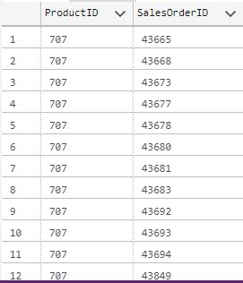

<pre>
select A.ProductID, A.Name, B.SalesOrderID from Production.Product AS A
LEFT JOIN Sales.SalesOrderDetail AS B
ON A.ProductID = B.ProductID
  </pre>
-- Left Join

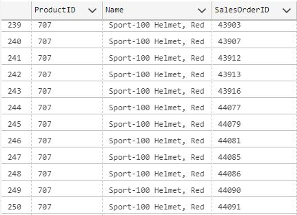

### Scenario 20: Select all records from second table and only the matching records from first table   

<pre>
select ProductID, Name from Production.Product
  </pre>
-- First Table

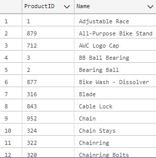

<pre>
select ProductID, Comments from Production.ProductReview
  </pre>
-- Second Table

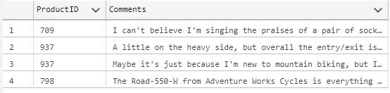

_Problem Statement: Find the reviews of products along with the product name (Right Join)_

<pre>
select B.ProductID, B.Comments, A.Name from Production.Product AS A
RIGHT JOIN Production.ProductReview AS B 
ON A.ProductID = B.ProductID

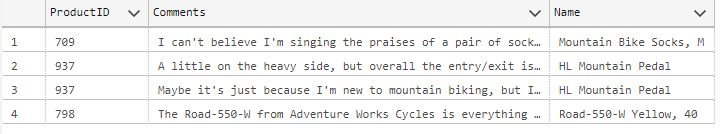

